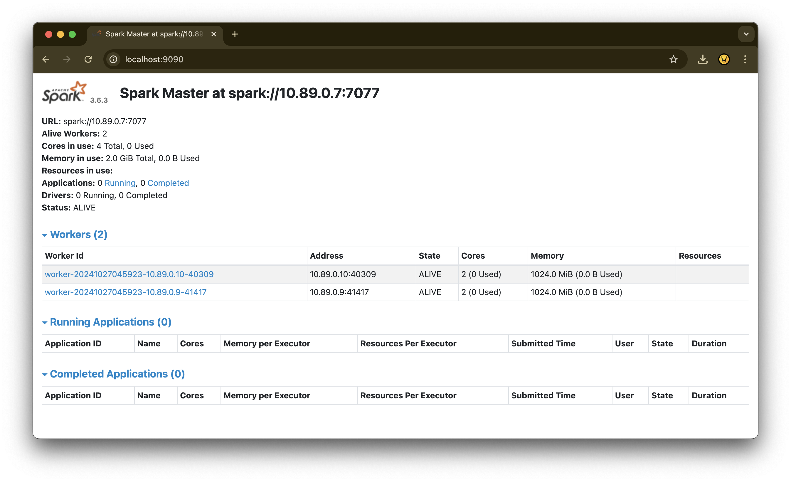

# smart-home-big-data-pipeline

Smart Home End to End Real-Time Data Streaming Pipeline

## Project Overview

This project aims to develop a comprehensive real-time data streaming pipeline for a Smart Home environment. The pipeline will capture, process, and analyze real-time data from the sensors and actuators in the different rooms, measuring key metrics such as temperature, humidity and brightness.

The pipeline leverages a combination of Apache Kafka, Apache Zookeeper, Google BigQuery and Apache Spark to ensure efficient data ingestion, processing, storage and analysis.

## Project Workflow


| Component              | Description                                                                                                                                                                                                                                  |
| ---------------------- | -------------------------------------------------------------------------------------------------------------------------------------------------------------------------------------------------------------------------------------------- |
| **Data Ingestion**     | Develop a robust and scalable pipeline for ingesting real-time data from various IoT devices using technologies such as Apache Kafka or MQTT.                                                                                                |
| **Data Storage**       | Design and implement a storage solution capable of handling both structured and unstructured data.                                                                                                                                           |
| **Data Processing**    | Build a scalable data processing pipeline using Apache Spark to handle large datasets, perform in-memory computations, and deliver real-time analytics.                                                                                      |
| **Advanced Analytics** | 1. Anomaly Detection: Develop and integrate anomaly detection algorithms to identify deviations from normal behavior. This will involve creating models that can detect potential health issues or system malfunctions based on sensor data. |
|                        | 2. Predictive Analytics: Develop machine learning models for predictive analytics to forecast potential equipment failures or optimize energy usage based on historical and real-time data.                                                  |
|                        | 3. Recommendation Engine: Utilize a graph database like Neo4j to create a recommendation engine that provides personalized suggestions based on user interactions with the smart home system.                                                |

## Dataset

We have used the dataset from a GitHub repository https://github.com/building-a-smart-home/OpenSmartHomeData

The dataset does not have any headers and is found in the Measurements folder, which contains set of csv files, which contain the measured sensor and actuator values.

**Sensor and Actuator Data Description**

The CSV files stored in Measurements folder are named and each contain one time series of measured data. The values are obtained for the Bathroom, Kitchen, Room 1, Room 2, Room 3 and the Toilet. The respective time series are stored separated by a tab, where the first column contains the UNIX time and the second is the reading of the sensor. A dot is used to denote floating point numbers.

| Data                  | Description                                                                                                                                                                                                             |
| --------------------- | ----------------------------------------------------------------------------------------------------------------------------------------------------------------------------------------------------------------------- |
| ThermostatTemperature | This is the air temperature measured at the thermostat mounted to the radiator. There is one room (Room 2) which has two thermostats. The value is measured in degrees Celsius and provided as a floating-point number. |
| Brightness            | This is the brightness measured by the luminance sensor placed in each room. It is reported as a floating point number, and the unit is lux.                                                                            |
| Humidity              | This is the relative humidity of the air inside each room, measured by the humidity sensor mounted on the wall. It returns the relative humidity as an integer percentage.                                              |
| Temperature           | This is the indoor air temperature in degrees Celsius, measured by the temperature sensor placed in each room.                                                                                                          |
| SetpointHistory       | This is the setpoint for the room in degrees Celsius as a floating-point number, defined by the controller's schedule.                                                                                                  |
| OutdoorTemperature    | This is the outside air temperature, obtained from a virtual weather service in degrees Celsius, and stored as a floating-point number.                                                                                 |

## Technologies Used

- Podman: an open-source containerization platform that allows developers to build, manage, and run containerized applications without requiring a central daemon like Docker. It supports running containers as rootless (non-privileged) users, enhancing security and flexibility.

- Apache Kafka: message queuing and managing real-time data streams, supporting high throughput and scalability for data ingestion.

- Google BigQuery: As the primary data warehouse for storing processed data in structured format, allowing fast querying and analytics at scale.

- Apache Spark: For data transformation, cleaning, and aggregation in real-time, ensuring the data is in a format ready for analytics and machine learning.

- Python: The primary language for scripting, data processing, and machine learning model development.

## Project Setup

```
brew install podman
brew install podman-compose

pip3 install confluent_kafka
pip3 install google-cloud-bigquery
pip3 install python-dotenv
```

Python Virtual Environment

```
# Create environment
python3 -m venv .venv
# Activate the env
source .venv/bin/activate

# Install Python libraries
pip3 install -r requirements.txt
```

Run Kafka and Zookeeper containers

```
podman-compose up
```

**Podman Desktop**


**Kafka Cluster**


**Spark Web UI**

http://localhost:9090



## Data Ingestion

**Real-Time Data Streaming**


**Producer**

```
python3 producer.py
```


**Consumer**

```
python3 consumer.py
```


## Data Storage

**Big Query**


## Demo

https://drive.google.com/file/d/1QQCwleQX-d8n7ieQ6p-2ABXxmAr9tfPf/view?usp=sharing

## Acknowledgements

| **Reference** | **Link**                                                   |
| ------------- | ---------------------------------------------------------- |
| Dataset       | https://github.com/building-a-smart-home/OpenSmartHomeData |
| Project       | https://github.com/DivineSamOfficial/SmartCityProject      |

## Other Dataset

| **Dataset**                                         | **Description**                                                                    | **Link**                                                                               |
| --------------------------------------------------- | ---------------------------------------------------------------------------------- | -------------------------------------------------------------------------------------- |
| Energy Consumption in a Smart Home                  | Detailed energy usage data for various appliances in a smart home.                 | https://www.kaggle.com/datasets/arnavsmayan/smart-home-energy-usage-dataset            |
| Smart Home Appliance Usage                          | Data on appliance usage patterns and energy consumption.                           | https://www.kaggle.com/datasets/arnavsmayan/smart-home-energy-usage-dataset            |
| Human Activity Recognition Using Smartphone Sensors | Sensor data from smartphones for recognizing human activities.                     | https://www.kaggle.com/datasets/uciml/human-activity-recognition-with-smartphones      |
| Sensor Data for Activity Recognition                | A broader collection of sensor data for various activity recognition tasks.        | https://www.mdpi.com/1424-8220/21/6/2141                                               |
| OSHD Dataset                                        | Comprehensive dataset covering a wide range of smart home sensors and data points. | https://github.com/TechnicalBuildingSystems/OpenSmartHomeData                          |
| MIT Human Activity Recognition Dataset              | Focuses on human activity recognition using accelerometer and gyroscope data.      | https://courses.media.mit.edu/2004fall/mas622j/04.projects/home/                       |
| Open Smart Home dataset                             | The time series of measured data from a smart home.                                | https://github.com/TechnicalBuildingSystems/OpenSmartHomeData/tree/master/Measurements |
